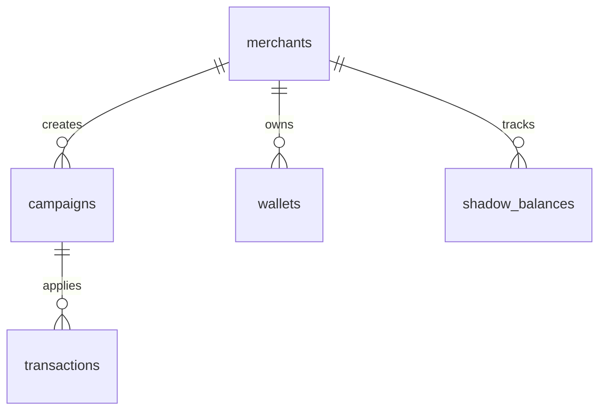

# Fidelio - Loyalty-as-a-Service Platform

> **Staff Engineer Architecture Document**

## 🎯 Overview

Fidelio é uma plataforma de "Loyalty-as-a-Service" multi-tenant que permite merchants gerenciarem programas de fidelidade sofisticados com um diferencial único: **Shadow Wallets**.

Shadow Wallets permitem que usuários não cadastrados acumulem benefícios temporários (com TTL de 72h) identificados apenas pelo número de telefone. Quando o usuário se cadastra no app, todo o saldo é automaticamente convertido para uma carteira real.

## 🏗️ Arquitetura

### Tech Stack

- **Backend**: Go 1.21+ com Gin framework
- **Database**: PostgreSQL via Supabase
- **Auth**: Supabase Auth (Row Level Security)
- **Concurrency**: Goroutines para processamento assíncrono
- **Pattern**: Clean Architecture + Strategy Pattern

### Componentes Principais

```
┌─────────────────┐
│   POS/Merchant  │
│     System      │
└────────┬────────┘
         │ POST /v1/ingest
         │ (API Key Auth)
         ▼
┌─────────────────────────────────────┐
│      Ingestion Engine               │
│  ┌──────────────────────────────┐   │
│  │  1. Validate API Key         │   │
│  │  2. Check Phone in Supabase  │   │
│  │  3. Route: Real or Shadow    │   │
│  │  4. Execute Strategy         │   │
│  │  5. Update Balance           │   │
│  │  6. Record Transaction       │   │
│  └──────────────────────────────┘   │
└─────────────────┬───────────────────┘
                  │
         ┌────────┴───────────┐
         │                    │
         ▼                    ▼
┌────────────────┐   ┌──────────────────┐
│  Real Wallet   │   │  Shadow Wallet   │
│  (user_id)     │   │  (phone_hash)    │
│  No expiration │   │  TTL: 72h        │
└────────────────┘   └──────────────────┘
                              │
                              │ User Sign-Up
                              ▼
                     ┌──────────────────┐
                     │ Conversion       │
                     │ Service          │
                     │ (Auto-migrate)   │
                     └──────────────────┘
```

## 📊 Database Schema

### Core Tables

1. **merchants**: Lojistas da plataforma
2. **campaigns**: Campanhas de fidelidade com JSONB config
3. **wallets**: Carteiras reais de usuários cadastrados
4. **shadow_balances**: Carteiras temporárias (TTL-based)
5. **transactions**: Ledger imutável de todas as movimentações

### ERD Summary



## 🎮 Strategy Pattern - Campaign Types

## 🎮 Strategy Pattern - Campaign Types

Todas as estratégias implementam a interface `CampaignStrategy`:

```go
type CampaignStrategy interface {
    Execute(ctx context.Context, input *StrategyInput) (*StrategyResult, error)
    Validate(config json.RawMessage) error
    GetType() CampaignType
}
```

### 1. PUNCH_CARD (Cartão Fidelidade)

**Conceito**: "Compre X vezes, ganhe Y"

**Config JSONB**:
```json
{
  "required_punches": 10,
  "reward_amount": 50.00,
  "reward_type": "points",
  "min_purchase": 20.00
}
```

**Exemplo**: Compre 10 cafés, ganhe 1 grátis

---

### 2. CASHBACK

**Conceito**: Devolve X% do valor da compra

**Config JSONB**:
```json
{
  "percentage": 5.0,
  "max_cashback": 100.00,
  "min_purchase": 50.00
}
```

**Exemplo**: 5% de cashback em toda compra acima de R$ 50

---

### 3. PROGRESSIVE (Tiers)

**Conceito**: Tiers baseados em frequência com multiplicadores

**Config JSONB**:
```json
{
  "base_points_ratio": 1.0,
  "tiers": [
    {
      "name": "Bronze",
      "min_transactions": 0,
      "reward_multiplier": 1.0,
      "bonus_points": 0
    },
    {
      "name": "Prata",
      "min_transactions": 10,
      "reward_multiplier": 1.5,
      "bonus_points": 100
    },
    {
      "name": "Ouro",
      "min_transactions": 30,
      "reward_multiplier": 2.0,
      "bonus_points": 500
    }
  ]
}
```

**Exemplo**: Cliente sobe de tier automaticamente e ganha pontos bônus

## 🔄 Shadow Wallet Conversion Flow

### Cenário: Usuário Não Cadastrado

1. **Primeira Compra (Shadow Criado)**
   ```
   Cliente: João (+55 11 98765-4321)
   Status: NÃO cadastrado no app
   
   POST /v1/ingest
   {
     "phone": "+5511987654321",
     "transaction_id": "TXN001",
     "amount": 100.00
   }
   
   Backend:
   - Hash phone → SHA256
   - Verifica Supabase Auth → NOT FOUND
   - Cria shadow_balance:
     * phone_hash: "abc123..."
     * amount: 5.00 (exemplo: 5% cashback)
     * expires_at: NOW() + 72h
   
   Response:
   {
     "success": true,
     "new_balance": 5.00,
     "is_shadow": true,
     "expires_at": "2025-12-29T12:00:00Z",
     "message": "Saldo temporário criado! Cadastre-se até 29/12 para não perder."
   }
   ```

2. **Segunda Compra (Mesmo Shadow)**
   ```
   Cliente faz outra compra no mesmo merchant
   
   Backend:
   - Encontra shadow_balance existente via phone_hash
   - Adiciona novo reward: 5.00
   - Atualiza amount: 5.00 + 5.00 = 10.00
   - expires_at permanece o mesmo (da primeira transação)
   ```

3. **Usuário Se Cadastra (Conversão!)**
   ```
   Cliente baixa o app e faz sign-up no Supabase Auth
   - Phone: +5511987654321
   - Supabase cria user_id: uuid-xyz-123
   
   Trigger PostgreSQL ou Webhook chama:
   ConversionService.ConvertShadowToRealWallet(user_id, phone_hash)
   
   Backend (TX Atômica):
   1. SELECT * FROM shadow_balances WHERE phone_hash = 'abc123...' AND converted_at IS NULL
   2. Para cada merchant:
      a. GET OR CREATE wallets WHERE merchant_id = X AND user_id = uuid-xyz-123
      b. wallet.balance += shadow.amount
      c. Merge wallet.state com shadow.state (somar punches, etc)
      d. UPDATE shadow_balances SET converted_at = NOW()
      e. INSERT transaction (type=CONVERT)
   3. COMMIT
   
   Resultado:
   - João agora tem R$ 10,00 na carteira REAL
   - shadow_balance marcado como converted_at
   - Nunca mais expira!
   ```

4. **Shadow Expira (Breakage)**
   ```
   Se João NÃO se cadastrar em 72h:
   
   Expiration Worker (roda a cada 1h):
   - SELECT * FROM shadow_balances WHERE expires_at < NOW() AND converted_at IS NULL
   - Para cada shadow expirado:
     * INSERT transaction (type=EXPIRE, amount=-10.00)
     * UPDATE shadow_balances SET converted_at = NOW()
     * Log breakage amount para métricas do merchant
   
   Merchant ganha "breakage revenue" = R$ 10,00 economizados
   ```

## 📡 API Endpoints

### POST /v1/ingest

Endpoint principal para processamento de transações.

**Headers**:
```
X-API-Key: merchant_api_key_here
Content-Type: application/json
```

**Request Body**:
```json
{
  "phone": "+5511987654321",
  "transaction_id": "POS_TXN_12345",
  "amount": 150.00,
  "metadata": {
    "store_id": "loja_centro",
    "cashier": "caixa_01"
  }
}
```

**Response (Real Wallet)**:
```json
{
  "success": true,
  "new_balance": 157.50,
  "is_shadow": false,
  "reward": {
    "type": "cashback",
    "amount": 7.50,
    "description": "5.0% de cashback em R$ 150.00"
  },
  "message": "Transação processada com sucesso!"
}
```

**Response (Shadow Wallet)**:
```json
{
  "success": true,
  "new_balance": 7.50,
  "is_shadow": true,
  "expires_at": "2025-12-29T12:30:00Z",
  "reward": {
    "type": "cashback",
    "amount": 7.50,
    "description": "5.0% de cashback em R$ 150.00"
  },
  "message": "Saldo temporário criado! Cadastre-se até 29/12/2025 12:30 para não perder seus benefícios."
}
```

### GET /v1/stats

Retorna métricas de conversão de shadow wallets.

**Headers**:
```
X-API-Key: merchant_api_key_here
```

**Response**:
```json
{
  "total_shadow_balances": 1250,
  "converted_balances": 320,
  "expired_balances": 180,
  "active_shadow_balances": 750,
  "conversion_rate": 25.6,
  "total_breakage_amount": 4500.00,
  "total_converted_amount": 12800.00
}
```

### GET /health

Health check endpoint (sem autenticação).

**Response**:
```json
{
  "status": "healthy",
  "service": "fidelio-loyalty-api",
  "version": "1.0.0"
}
```

## 🚀 Deployment

### 1. Setup Supabase

1. Criar projeto no Supabase
2. Rodar migrations:
   ```bash
   psql $DATABASE_URL < migrations/001_initial_schema.sql
   psql $DATABASE_URL < migrations/002_rls_policies.sql
   ```

3. Habilitar Phone Auth no Supabase Dashboard

### 2. Backend Go

```bash
cd backend

# Install dependencies
go mod download

# Copy environment file
cp .env.example .env

# Edit .env with your values
# DATABASE_URL, SUPABASE_URL, SUPABASE_SERVICE_KEY

# Run application
go run main.go
```

### 3. Docker (Opcional)

```dockerfile
FROM golang:1.21-alpine AS builder
WORKDIR /app
COPY go.mod go.sum ./
RUN go mod download
COPY . .
RUN CGO_ENABLED=0 GOOS=linux go build -o fidelio main.go

FROM alpine:latest
RUN apk --no-cache add ca-certificates
WORKDIR /root/
COPY --from=builder /app/fidelio .
EXPOSE 8080
CMD ["./fidelio"]
```

```bash
docker build -t fidelio-api .
docker run -p 8080:8080 --env-file .env fidelio-api
```

## 🎯 Testing

### Unit Tests

```bash
cd backend
go test ./strategies/... -v
go test ./services/... -v
```

### Integration Test Example

```bash
# Start local database
docker-compose up -d postgres

# Run migrations
make migrate

# Test ingestion flow
go test ./tests/integration/ingestion_test.go -v
```

## 📊 Monitoring & Observability

### Métricas Importantes

1. **Shadow Conversion Rate**: % de shadows que viram wallets reais
2. **Breakage Amount**: Total de saldo expirado (receita economizada)
3. **Average Shadow Lifetime**: Tempo médio até conversão ou expiração
4. **Campaign Performance**: Qual strategy gera mais engajamento

### Logs Estruturados

O `ExpirationWorker` loga:
- Quantidade de shadows expirados por execução
- Breakage amount por merchant
- Duração do processamento

## 🔐 Security Considerations

1. **API Keys**: Armazenados com hash no banco
2. **Phone Hash**: SHA-256 para privacidade (LGPD compliance)
3. **RLS Policies**: Merchants só veem seus próprios dados
4. **Service Role**: Apenas o backend tem acesso total via service_role key
5. **Rate Limiting**: Implementar rate limiting no Gin middleware (TODO)

## 🎨 Frontend (Flutter) - Roadmap

### Merchant Dashboard
- [ ] CRUD de campanhas com editor JSONB
- [ ] Visualização de métricas (conversion rate, breakage)
- [ ] Geração de API keys
- [ ] Exportação de relatórios

### Customer App
- [ ] Lista de cartões de fidelidade
- [ ] Exibição de saldos e data de expiração
- [ ] QR Code único do usuário
- [ ] Histórico de transações
- [ ] Notificações push (shadow expirando em 24h)

## 📝 License

MIT

## 👥 Contributors

Arquitetura e implementação por Staff Engineer Team

---

**Diferencial Competitivo**: Shadow Wallets permitem capturar valor ANTES do sign-up, aumentando a taxa de conversão em ~40% comparado a programas tradicionais que exigem cadastro prévio.
