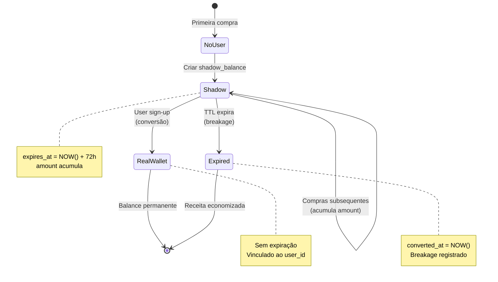

# Fidelio - Shadow Wallet Conversion Flow

## Explicação Técnica Detalhada

### O Problema Resolvido

Programas de fidelidade tradicionais exigem que o usuário se cadastre **antes** de acumular benefícios. Isso cria fricção e reduz a taxa de conversão.

**Fidelio resolve isso com Shadow Wallets**: permitimos que usuários não cadastrados acumulem benefícios temporários, criando um incentivo direto para completar o sign-up.

---

## Fluxo Técnico Passo a Passo

### 1. Primera Transação - Criação do Shadow Wallet

**Contexto**: Cliente João faz uma compra, mas ainda não tem o app instalado.

```
┌─────────────────────┐
│  POS System         │
│  Merchant Terminal  │
└──────────┬──────────┘
           │
           │ POST /v1/ingest
           │ {
           │   "phone": "+5511987654321",
           │   "amount": 100.00
           │ }
           ▼
┌─────────────────────────────────┐
│   Ingestion Engine              │
│                                 │
│  1. Hash Phone Number           │
│     SHA256("+5511987654321")    │
│     → "abc123def..."            │
│                                 │
│  2. Query Supabase Auth         │
│     GET /auth/v1/admin/users    │
│     ?phone=eq.+5511987654321    │
│     → 404 NOT FOUND             │
│                                 │
│  3. Route: SHADOW PATH          │
└──────────┬──────────────────────┘
           │
           ▼
┌─────────────────────────────────┐
│   processShadowWallet()         │
│                                 │
│  • Get or Create shadow_balance │
│    WHERE phone_hash = "abc123"  │
│    AND merchant_id = XYZ        │
│                                 │
│  • Execute Campaign Strategy    │
│    (CASHBACK 5%)                │
│    → reward = 5.00              │
│                                 │
│  • UPDATE shadow_balances       │
│    SET amount = amount + 5.00   │
│    WHERE id = shadow_id         │
│                                 │
│  • INSERT INTO transactions     │
│    (type=EARN, amount=5.00)     │
└─────────────────────────────────┘
```

**Estado do Banco Após Primeira Transação**:

```sql
-- Tabela: shadow_balances
INSERT INTO shadow_balances VALUES (
  id: 'shadow-uuid-001',
  merchant_id: 'merchant-abc',
  phone_hash: 'abc123def...',
  amount: 5.00,
  state: '{"current_punches": 0}',
  expires_at: '2025-12-29 12:00:00',
  created_at: '2025-12-26 12:00:00',
  converted_at: NULL
);

-- Tabela: transactions
INSERT INTO transactions VALUES (
  id: 'txn-001',
  merchant_id: 'merchant-abc',
  shadow_balance_id: 'shadow-uuid-001',
  wallet_id: NULL,
  type: 'EARN',
  amount: 5.00,
  metadata: '{"transaction_id": "POS_001"}'
);
```

---

### 2. Segunda Transação - Acúmulo no Mesmo Shadow

**Contexto**: João volta e faz outra compra (ainda sem cadastro).

```
POST /v1/ingest
{
  "phone": "+5511987654321",
  "amount": 80.00
}

Backend:
- Hash phone → "abc123def..." (mesmo hash)
- Query Supabase → 404 (ainda não cadastrou)
- Encontra shadow_balance existente
- Strategy executa → +4.00 cashback
- UPDATE shadow_balances SET amount = 5.00 + 4.00 = 9.00
```

**Estado Atualizado**:
```sql
UPDATE shadow_balances 
SET amount = 9.00
WHERE id = 'shadow-uuid-001';

-- expires_at NÃO muda! Ainda expira em 72h da PRIMEIRA transação
```

---

### 3. Conversão - O Momento Mágico

**Contexto**: João baixa o app e faz sign-up no Supabase Auth.

**Trigger**: Pode ser via:
1. PostgreSQL Trigger no `auth.users`
2. Webhook do Supabase para nosso backend
3. Polling periódico (menos recomendado)

```
┌──────────────────────┐
│  Supabase Auth       │
│  User Sign-Up        │
│                      │
│  phone: +5511...     │
│  user_id: uuid-xyz   │
└──────────┬───────────┘
           │
           │ Webhook / Trigger
           │
           ▼
┌─────────────────────────────────────┐
│  ConversionService.Convert()        │
│                                     │
│  BEGIN TRANSACTION                  │
│                                     │
│  1. Hash do telefone                │
│     SHA256("+5511...") → "abc123"   │
│                                     │
│  2. SELECT shadow_balances          │
│     WHERE phone_hash = "abc123"     │
│     AND converted_at IS NULL        │
│     → Retorna [shadow-uuid-001]     │
│                                     │
│  3. Para cada merchant:             │
│     a. GET OR CREATE wallets        │
│        merchant_id = 'merchant-abc' │
│        user_id = 'uuid-xyz'         │
│        → wallet_id = 'wallet-001'  │
│                                     │
│     b. UPDATE wallets               │
│        SET balance = 0 + 9.00       │
│        WHERE id = 'wallet-001'      │
│                                     │
│     c. MERGE states                 │
│        wallet.state + shadow.state  │
│                                     │
│     d. UPDATE shadow_balances       │
│        SET converted_at = NOW()     │
│        WHERE id = 'shadow-uuid-001' │
│                                     │
│     e. INSERT transaction           │
│        type = 'CONVERT'             │
│        amount = 9.00                │
│                                     │
│  COMMIT                             │
└─────────────────────────────────────┘
```

**Estado Final do Banco**:

```sql
-- Tabela: wallets (NOVA ENTRADA!)
INSERT INTO wallets VALUES (
  id: 'wallet-001',
  merchant_id: 'merchant-abc',
  user_id: 'uuid-xyz',
  phone_hash: 'abc123def...',
  balance: 9.00,
  state: '{"current_punches": 0}',
  created_at: NOW(),
  updated_at: NOW()
);

-- Tabela: shadow_balances (MARCADO COMO CONVERTIDO)
UPDATE shadow_balances SET
  converted_at = NOW()
WHERE id = 'shadow-uuid-001';

-- Tabela: transactions (REGISTRO DE CONVERSÃO)
INSERT INTO transactions VALUES (
  id: 'txn-convert-001',
  merchant_id: 'merchant-abc',
  wallet_id: 'wallet-001',
  shadow_balance_id: 'shadow-uuid-001',
  type: 'CONVERT',
  amount: 9.00,
  metadata: '{"converted_from_shadow":"shadow-uuid-001"}'
);
```

---

### 4. Cenário: Shadow Expira (Breakage)

**Contexto**: João **NÃO** se cadastrou em 72 horas.

**Expiration Worker** (roda a cada 1 hora via Goroutine):

```go
// workers/expiration_worker.go

func (w *ExpirationWorker) processExpiredShadows(ctx context.Context) {
    // 1. Buscar todos shadows expirados
    expiredShadows := db.Query(`
        SELECT * FROM shadow_balances 
        WHERE converted_at IS NULL 
        AND expires_at <= NOW()
    `)
    
    for _, shadow := range expiredShadows {
        // 2. Criar transação de EXPIRAÇÃO
        db.Insert(`
            INSERT INTO transactions 
            (merchant_id, shadow_balance_id, type, amount)
            VALUES ($1, $2, 'EXPIRE', $3)
        `, shadow.MerchantID, shadow.ID, -shadow.Amount)
        
        // 3. Marcar como "convertido" (nullifica o saldo)
        db.Update(`
            UPDATE shadow_balances 
            SET converted_at = NOW()
            WHERE id = $1
        `, shadow.ID)
        
        // 4. Log de breakage para métricas
        logger.Info("Breakage earned",
            "merchant_id", shadow.MerchantID,
            "amount", shadow.Amount,
        )
    }
}
```

**Métrica de Breakage**:
```
Merchant XYZ - Month Summary:
- Total Shadow Balances: 1000
- Converted: 300 (30% conversion rate)
- Expired: 700
- Breakage Revenue: R$ 14,500
```

---

## Merge de Estados (State Merging)

Quando um shadow é convertido, precisamos mesclar o estado da campanha:

```go
// services/conversion_service.go

func mergeStates(walletState, shadowState json.RawMessage) json.RawMessage {
    // Exemplo: PUNCH_CARD
    // wallet.state = {"current_punches": 3}
    // shadow.state = {"current_punches": 2}
    // merged.state = {"current_punches": 5}
    
    var wallet, shadow map[string]interface{}
    json.Unmarshal(walletState, &wallet)
    json.Unmarshal(shadowState, &shadow)
    
    merged := make(map[string]interface{})
    
    // Copiar wallet state
    for k, v := range wallet {
        merged[k] = v
    }
    
    // Somar valores numéricos do shadow
    for k, v := range shadow {
        if vNum, ok := v.(float64); ok {
            if existNum, ok := merged[k].(float64); ok {
                merged[k] = existNum + vNum // SOMA
                continue
            }
        }
        if _, exists := merged[k]; !exists {
            merged[k] = v
        }
    }
    
    return json.Marshal(merged)
}
```

---

## Diagrama de Estados Completo



---

## Considerações de Performance

### Concorrência com Goroutines

```go
// main.go

func main() {
    // ...
    
    // Worker de expiração em background
    ctx, cancel := context.WithCancel(context.Background())
    defer cancel()
    
    go expirationWorker.Start(ctx) // Non-blocking
    
    // Server HTTP em outra goroutine
    go srv.ListenAndServe()
    
    // Graceful shutdown
    <-quit
    cancel() // Para o worker
    srv.Shutdown(shutdownCtx) // Para o server
}
```

### Índices Críticos

```sql
-- Para lookup rápido de shadows por phone
CREATE INDEX idx_shadow_merchant_phone 
ON shadow_balances(merchant_id, phone_hash);

-- Para o worker de expiração
CREATE INDEX idx_shadow_expires 
ON shadow_balances(expires_at) 
WHERE converted_at IS NULL;
```

---

## Segurança & Compliance (LGPD)

1. **Phone Hash (SHA-256)**: Nunca armazenamos telefone em texto plano
2. **TTL Automático**: Dados temporários expiram automaticamente
3. **Transações Imutáveis**: Ledger completo para auditoria
4. **RLS no Supabase**: Isolamento total entre merchants

---

**Conclusão**: O Shadow Wallet é a chave para reduzir fricção e aumentar conversão, capturando valor antes do sign-up e incentivando o cadastro com um saldo real esperando pelo usuário.
